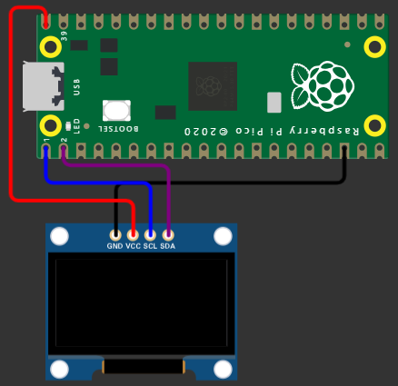

# **Tecnológico Nacional de México**
# **Instituto Tecnológico de Tijuana**
# **Subdirección Académica**
# **Depto de Sistemas y Computación**
# **SEMESTRE: AGOSTO – DICIEMBRE 2023**
# **Ing. En Sistemas Computacionales**
# **SISTEMAS PROGRAMABLES 23a**
# **Estevez Ramirez Maria Teresa - 20211773**
## FECHA: 14 de octubre del 2023

# **Animación de la temperatura en OLED Display**
## Código 
```python
#Importación de librerias
from machine import Pin, I2C
from ssd1306 import SSD1306_I2C
import framebuf, sys
import utime

# Definir la resolución de píxeles en el eje X y el eje Y
pix_res_x = 128
pix_res_y = 64
# Lee valores analógicos del pin GPIO 4 en la placa Pico
sensor_temp = machine.ADC(4)
#  Converte los valores leídos del sensor de temperatura en voltaje.
conversion_factor = 3.3 / (65535)

# La funcion configura una comunicación I2C en la Pico W
def init_i2c(scl_pin, sda_pin):
    # Initialize I2C device
    i2c_dev = I2C(0, scl=Pin(scl_pin), sda=Pin(sda_pin), freq=200000)
# Busca de dispositivos conectados y se obtiene una lista de las direcciones I2C detectadas 
    i2c_addr = [hex(ii) for ii in i2c_dev.scan()]
# Indica si o no se detectan direcciones I2C
    if not i2c_addr:
        print('No I2C Display Found')
        sys.exit()
    else:
        print("I2C Address      : {}".format(i2c_addr[0]))
        print("I2C Configuration: {}".format(i2c_dev))
# Devuelve el bus I2C configurado y listo para su uso
    return i2c_dev

#La función muestra un logotipo o imagen en una pantalla OLED 
def display_logo(oled):
    
    # Definir una matriz de bytes que representa la imagen
    a1 = bytearray([0xff, 0xff, 0xff, 0xff, 0xff, 0xff, 0xc0, 0xff, 0xff, 0xff, 0xff, 0xff, 0xff, 0xc0, 0xff, 0xff, 
0xff, 0xff, 0xff, 0xff, 0xc0, 0xff, 0xff, 0xff, 0xff, 0xff, 0xff, 0xc0, 0xff, 0xff, 0xff, 0xff, 
0xff, 0xff, 0xc0, 0xff, 0xff, 0xff, 0xff, 0xff, 0xff, 0xc0, 0xff, 0xff, 0xff, 0xff, 0xff, 0xff, 
0xc0, 0xff, 0xff, 0xff, 0xff, 0xff, 0xff, 0xc0, 0xff, 0xff, 0xff, 0xff, 0xff, 0xff, 0xc0, 0xff, 
0xff, 0xff, 0x00, 0x3f, 0xff, 0xc0, 0xff, 0xff, 0xfc, 0x00, 0x0f, 0xff, 0xc0, 0xff, 0xff, 0xf8, 
0x7f, 0x87, 0xff, 0xc0, 0xff, 0xff, 0xf1, 0xff, 0xe3, 0xff, 0xc0, 0xff, 0xff, 0xe3, 0xff, 0xf1, 
0xff, 0xc0, 0xff, 0xff, 0xc7, 0xff, 0xf8, 0xff, 0xc0, 0xff, 0xc0, 0x0f, 0xff, 0xfc, 0x7f, 0xc0, 
0xff, 0x80, 0x1f, 0xff, 0xfe, 0x7f, 0xc0, 0xff, 0x1f, 0x1f, 0xff, 0xfe, 0x7f, 0xc0, 0xfe, 0x3f, 
0xbf, 0xff, 0xff, 0x3f, 0xc0, 0xfe, 0x7f, 0xff, 0xff, 0xff, 0x3f, 0xc0, 0xfc, 0x7f, 0xff, 0xff, 
0xff, 0x3f, 0xc0, 0xfc, 0xff, 0xff, 0xff, 0xff, 0x3f, 0xc0, 0xf0, 0xff, 0xff, 0xff, 0xff, 0x1f, 
0xc0, 0xe1, 0xff, 0xff, 0xff, 0xff, 0x03, 0xc0, 0xc7, 0xff, 0xff, 0xff, 0xff, 0xc1, 0xc0, 0x8f, 
0xff, 0xff, 0xff, 0xff, 0xf8, 0xc0, 0x9f, 0xff, 0xff, 0xff, 0xff, 0xfc, 0x40, 0x1f, 0xff, 0xff, 
0xff, 0xff, 0xfe, 0x40, 0x3f, 0xff, 0xff, 0xff, 0xff, 0xfe, 0x00, 0x3f, 0xff, 0xff, 0xff, 0xff, 
0xff, 0x00, 0x3f, 0xff, 0xff, 0xff, 0xff, 0xff, 0x00, 0x3f, 0xff, 0xff, 0xff, 0xff, 0xff, 0x00, 
0x3f, 0xff, 0xff, 0xff, 0xff, 0xff, 0x00, 0x1f, 0xff, 0xff, 0xff, 0xff, 0xff, 0x00, 0x9f, 0xff, 
0xff, 0xff, 0xff, 0xfe, 0x40, 0x8f, 0xff, 0xff, 0xff, 0xff, 0xfc, 0x40, 0xc7, 0xff, 0xff, 0xff, 
0xff, 0xf8, 0xc0, 0xe1, 0xff, 0xff, 0xff, 0xff, 0xf1, 0xc0, 0xf0, 0x00, 0x00, 0x00, 0x00, 0x03, 
0xc0, 0xfc, 0x00, 0x00, 0x00, 0x00, 0x0f, 0xc0, 0xff, 0xff, 0xff, 0xff, 0xff, 0xff, 0xc0, 0xff, 
0xff, 0xff, 0xff, 0xff, 0xff, 0xc0, 0xff, 0xff, 0xff, 0xff, 0xff, 0xff, 0xc0, 0xff, 0xff, 0xff, 
0xff, 0xff, 0xff, 0xc0, 0xff, 0xff, 0xff, 0xff, 0xff, 0xff, 0xc0, 0xff, 0xff, 0xff, 0xff, 0xff, 
0xff, 0xc0, 0xff, 0xff, 0xff, 0xff, 0xff, 0xff, 0xc0, 0xff, 0xff, 0xff, 0xff, 0xff, 0xff, 0xc0, 
0xff, 0xff, 0xff, 0xff, 0xff, 0xff, 0xc0, 0xff, 0xff, 0xff, 0xff, 0xff, 0xff, 0xc0])

    a2 = bytearray([0xff, 0xff, 0xff, 0xff, 0xff, 0xff, 0xc0, 0xff, 0xff, 0xff, 0xff, 0xff, 0xff, 0xc0, 0xff, 0xff, 
0xff, 0xff, 0xff, 0xff, 0xc0, 0xff, 0xff, 0xff, 0xff, 0xff, 0xff, 0xc0, 0xff, 0xff, 0xff, 0xff, 
0xff, 0xff, 0xc0, 0xff, 0xff, 0xff, 0xff, 0xff, 0xff, 0xc0, 0xff, 0xff, 0xff, 0xff, 0xff, 0xff, 
0xc0, 0xff, 0xff, 0xff, 0xff, 0xff, 0xff, 0xc0, 0xff, 0xff, 0xff, 0xff, 0xff, 0xff, 0xc0, 0xff, 
0xff, 0xff, 0x3f, 0x3f, 0xff, 0xc0, 0xff, 0xff, 0xfd, 0xc0, 0xef, 0xff, 0xc0, 0xff, 0xff, 0xfa, 
0x7f, 0x97, 0xff, 0xc0, 0xff, 0xff, 0xfd, 0xff, 0xeb, 0xff, 0xc0, 0xff, 0xff, 0xeb, 0xff, 0xf5, 
0xff, 0xc0, 0xff, 0xff, 0xd7, 0xff, 0xfa, 0xff, 0xc0, 0xff, 0xce, 0x2f, 0xff, 0xfd, 0x7f, 0xc0, 
0xff, 0xb1, 0xff, 0xff, 0xff, 0x7f, 0xc0, 0xff, 0x5f, 0xdf, 0xff, 0xfe, 0xff, 0xc0, 0xfe, 0xbf, 
0xff, 0xff, 0xfe, 0xbf, 0xc0, 0xff, 0x7f, 0xff, 0xff, 0xff, 0xbf, 0xc0, 0xff, 0x7f, 0xff, 0xff, 
0xff, 0xbf, 0xc0, 0xfd, 0xff, 0xff, 0xff, 0xff, 0xff, 0xc0, 0xf7, 0xff, 0xff, 0xff, 0xff, 0xdf, 
0xc0, 0xe9, 0xff, 0xff, 0xff, 0xff, 0xf3, 0xc0, 0xd7, 0xff, 0xff, 0xff, 0xff, 0xcd, 0xc0, 0xaf, 
0xff, 0xff, 0xff, 0xff, 0xfa, 0xc0, 0xdf, 0xff, 0xff, 0xff, 0xff, 0xfd, 0x40, 0x5f, 0xff, 0xff, 
0xff, 0xff, 0xfe, 0x40, 0x7f, 0xff, 0xff, 0xff, 0xff, 0xfe, 0x80, 0x7f, 0xff, 0xff, 0xff, 0xff, 
0xff, 0x80, 0x7f, 0xff, 0xff, 0xff, 0xff, 0xff, 0x80, 0x7f, 0xff, 0xff, 0xff, 0xff, 0xff, 0x80, 
0x7f, 0xff, 0xff, 0xff, 0xff, 0xff, 0x80, 0xdf, 0xff, 0xff, 0xff, 0xff, 0xfe, 0x80, 0xbf, 0xff, 
0xff, 0xff, 0xff, 0xfe, 0xc0, 0xaf, 0xff, 0xff, 0xff, 0xff, 0xfd, 0x40, 0xd7, 0xff, 0xff, 0xff, 
0xff, 0xfa, 0xc0, 0xed, 0xff, 0xff, 0xff, 0xff, 0xe5, 0xc0, 0xf3, 0xff, 0xff, 0xff, 0xff, 0xfb, 
0xc0, 0xfe, 0x7f, 0xff, 0xff, 0xff, 0xcf, 0xc0, 0xff, 0xff, 0xff, 0xff, 0xff, 0xff, 0xc0, 0xff, 
0xff, 0xff, 0xff, 0xff, 0xff, 0xc0, 0xff, 0xff, 0xff, 0xff, 0xff, 0xff, 0xc0, 0xff, 0xff, 0xff, 
0xff, 0xff, 0xff, 0xc0, 0xff, 0xff, 0xff, 0xff, 0xff, 0xff, 0xc0, 0xff, 0xff, 0xff, 0xff, 0xff, 
0xff, 0xc0, 0xff, 0xff, 0xff, 0xff, 0xff, 0xff, 0xc0, 0xff, 0xff, 0xff, 0xff, 0xff, 0xff, 0xc0, 
0xff, 0xff, 0xff, 0xff, 0xff, 0xff, 0xc0, 0xff, 0xff, 0xff, 0xff, 0xff, 0xff, 0xc0])

    a3 = bytearray([0xff, 0xff, 0xff, 0xff, 0xff, 0xff, 0xc0, 0xff, 0xff, 0xff, 0xff, 0xff, 0xff, 0xc0, 0xff, 0xff, 
0xff, 0xff, 0xff, 0xff, 0xc0, 0xff, 0xff, 0xff, 0xff, 0xff, 0xff, 0xc0, 0xff, 0xff, 0xff, 0xff, 
0xff, 0xff, 0xc0, 0xff, 0xff, 0xff, 0xff, 0xff, 0xff, 0xc0, 0xff, 0xff, 0xff, 0xff, 0xff, 0xff, 
0xc0, 0xff, 0xff, 0xff, 0xff, 0xff, 0xff, 0xc0, 0xff, 0xff, 0xff, 0xff, 0xff, 0xff, 0xc0, 0xff, 
0xff, 0xff, 0x3f, 0x3f, 0xff, 0xc0, 0xff, 0xff, 0xfc, 0xc0, 0xcf, 0xff, 0xc0, 0xff, 0xff, 0xfa, 
0x7f, 0x97, 0xff, 0xc0, 0xff, 0xff, 0xf5, 0xff, 0xeb, 0xff, 0xc0, 0xff, 0xff, 0xeb, 0xff, 0xf5, 
0xff, 0xc0, 0xff, 0xff, 0xd7, 0xff, 0xfa, 0xff, 0xc0, 0xff, 0xce, 0x6f, 0xff, 0xfd, 0xff, 0xc0, 
0xff, 0xb1, 0xff, 0xff, 0xff, 0x7f, 0xc0, 0xff, 0x5f, 0x5f, 0xff, 0xfe, 0xff, 0xc0, 0xfe, 0xbf, 
0xdf, 0xff, 0xfe, 0xbf, 0xc0, 0xfe, 0x7f, 0xff, 0xff, 0xff, 0xbf, 0xc0, 0xff, 0x7f, 0xff, 0xff, 
0xff, 0xbf, 0xc0, 0xfd, 0x7f, 0xff, 0xff, 0xff, 0xbf, 0xc0, 0xf7, 0x7f, 0xff, 0xff, 0xff, 0x9f, 
0xc0, 0xe9, 0xff, 0xff, 0xff, 0xff, 0xf7, 0xc0, 0xd7, 0xff, 0xff, 0xff, 0xff, 0xcd, 0xc0, 0xaf, 
0xff, 0xff, 0xff, 0xff, 0xfa, 0xc0, 0x9f, 0xff, 0xff, 0xff, 0xff, 0xfd, 0x40, 0xdf, 0xff, 0xff, 
0xff, 0xff, 0xfe, 0x40, 0x7f, 0xff, 0xff, 0xff, 0xff, 0xfe, 0xc0, 0x7f, 0xff, 0xff, 0xff, 0xff, 
0xff, 0x80, 0x7f, 0xff, 0xff, 0xff, 0xff, 0xff, 0x80, 0x7f, 0xff, 0xff, 0xff, 0xff, 0xff, 0x80, 
0x5f, 0xff, 0xff, 0xff, 0xff, 0xff, 0x80, 0xdf, 0xff, 0xff, 0xff, 0xff, 0xfe, 0x80, 0xbf, 0xff, 
0xff, 0xff, 0xff, 0xfe, 0xc0, 0xef, 0xff, 0xff, 0xff, 0xff, 0xfd, 0x40, 0xd7, 0xff, 0xff, 0xff, 
0xff, 0xfa, 0xc0, 0xec, 0xff, 0xff, 0xff, 0xff, 0xe5, 0xc0, 0xfb, 0xff, 0xff, 0xff, 0xff, 0xfb, 
0xc0, 0xfe, 0x00, 0x00, 0x00, 0x00, 0x0f, 0xc0, 0xff, 0xff, 0xff, 0xff, 0xff, 0xff, 0xc0, 0xff, 
0xff, 0xff, 0xff, 0xff, 0xff, 0xc0, 0xff, 0xff, 0xff, 0xff, 0xff, 0xff, 0xc0, 0xff, 0xff, 0xff, 
0xff, 0xff, 0xff, 0xc0, 0xff, 0xff, 0xff, 0xff, 0xff, 0xff, 0xc0, 0xff, 0xff, 0xff, 0xff, 0xff, 
0xff, 0xc0, 0xff, 0xff, 0xff, 0xff, 0xff, 0xff, 0xc0, 0xff, 0xff, 0xff, 0xff, 0xff, 0xff, 0xc0, 
0xff, 0xff, 0xff, 0xff, 0xff, 0xff, 0xc0, 0xff, 0xff, 0xff, 0xff, 0xff, 0xff, 0xc0])

    a4 = bytearray([0xff, 0xff, 0xff, 0xff, 0xff, 0xff, 0xc0, 0xff, 0xff, 0xff, 0xff, 0xff, 0xff, 0xc0, 0xff, 0xff, 
0xff, 0xff, 0xff, 0xff, 0xc0, 0xff, 0xff, 0xff, 0xff, 0xff, 0xff, 0xc0, 0xff, 0xff, 0xff, 0xff, 
0xff, 0xff, 0xc0, 0xff, 0xff, 0xff, 0xff, 0xff, 0xff, 0xc0, 0xff, 0xff, 0xff, 0xff, 0xff, 0xff, 
0xc0, 0xff, 0xff, 0xff, 0xff, 0xff, 0xff, 0xc0, 0xff, 0xff, 0xff, 0xff, 0xff, 0xff, 0xc0, 0xff, 
0xff, 0xff, 0x9e, 0x7f, 0xff, 0xc0, 0xff, 0xff, 0xfe, 0xc0, 0xdf, 0xff, 0xc0, 0xff, 0xff, 0xfa, 
0x7f, 0x97, 0xff, 0xc0, 0xff, 0xff, 0xf5, 0xff, 0xeb, 0xff, 0xc0, 0xff, 0xff, 0xeb, 0xff, 0xf5, 
0xff, 0xc0, 0xff, 0xff, 0xd7, 0xff, 0xfa, 0xff, 0xc0, 0xff, 0xe6, 0xef, 0xff, 0xfd, 0xff, 0xc0, 
0xff, 0xb1, 0xff, 0xff, 0xfd, 0x7f, 0xc0, 0xff, 0x5f, 0x5f, 0xff, 0xfe, 0x7f, 0xc0, 0xfe, 0xbf, 
0xdf, 0xff, 0xfe, 0xff, 0xc0, 0xfe, 0x7f, 0xff, 0xff, 0xff, 0xbf, 0xc0, 0xff, 0x7f, 0xff, 0xff, 
0xff, 0xbf, 0xc0, 0xfd, 0x7f, 0xff, 0xff, 0xff, 0xbf, 0xc0, 0xf3, 0x7f, 0xff, 0xff, 0xff, 0xbf, 
0xc0, 0xe9, 0xff, 0xff, 0xff, 0xff, 0xf7, 0xc0, 0xd7, 0xff, 0xff, 0xff, 0xff, 0xcd, 0xc0, 0xef, 
0xff, 0xff, 0xff, 0xff, 0xfa, 0xc0, 0xbf, 0xff, 0xff, 0xff, 0xff, 0xfd, 0xc0, 0xdf, 0xff, 0xff, 
0xff, 0xff, 0xff, 0x40, 0xdf, 0xff, 0xff, 0xff, 0xff, 0xfe, 0xc0, 0x7f, 0xff, 0xff, 0xff, 0xff, 
0xfe, 0x80, 0x7f, 0xff, 0xff, 0xff, 0xff, 0xff, 0x80, 0x5f, 0xff, 0xff, 0xff, 0xff, 0xff, 0x80, 
0xdf, 0xff, 0xff, 0xff, 0xff, 0xfe, 0x80, 0x9f, 0xff, 0xff, 0xff, 0xff, 0xfe, 0xc0, 0xaf, 0xff, 
0xff, 0xff, 0xff, 0xfe, 0x40, 0xc7, 0xff, 0xff, 0xff, 0xff, 0xfd, 0xc0, 0xf3, 0xff, 0xff, 0xff, 
0xff, 0xfa, 0xc0, 0xf4, 0xff, 0xff, 0xff, 0xff, 0xe5, 0xc0, 0xfb, 0xff, 0xff, 0xff, 0xff, 0xf3, 
0xc0, 0xfe, 0x00, 0x00, 0x00, 0x00, 0x1f, 0xc0, 0xff, 0xff, 0xff, 0xff, 0xff, 0xff, 0xc0, 0xff, 
0xff, 0xff, 0xff, 0xff, 0xff, 0xc0, 0xff, 0xff, 0xff, 0xff, 0xff, 0xff, 0xc0, 0xff, 0xff, 0xff, 
0xff, 0xff, 0xff, 0xc0, 0xff, 0xff, 0xff, 0xff, 0xff, 0xff, 0xc0, 0xff, 0xff, 0xff, 0xff, 0xff, 
0xff, 0xc0, 0xff, 0xff, 0xff, 0xff, 0xff, 0xff, 0xc0, 0xff, 0xff, 0xff, 0xff, 0xff, 0xff, 0xc0, 
0xff, 0xff, 0xff, 0xff, 0xff, 0xff, 0xc0, 0xff, 0xff, 0xff, 0xff, 0xff, 0xff, 0xc0])

    a5 = bytearray([0xff, 0xff, 0xff, 0xff, 0xff, 0xff, 0xc0, 0xff, 0xff, 0xff, 0xff, 0xff, 0xff, 0xc0, 0xff, 0xff, 
0xff, 0xff, 0xff, 0xff, 0xc0, 0xff, 0xff, 0xff, 0xff, 0xff, 0xff, 0xc0, 0xff, 0xff, 0xff, 0xff, 
0xff, 0xff, 0xc0, 0xff, 0xff, 0xff, 0xff, 0xff, 0xff, 0xc0, 0xff, 0xff, 0xff, 0xff, 0xff, 0xff, 
0xc0, 0xff, 0xff, 0xff, 0xff, 0xff, 0xff, 0xc0, 0xff, 0xff, 0xff, 0xff, 0xff, 0xff, 0xc0, 0xff, 
0xff, 0xff, 0x8c, 0x7f, 0xff, 0xc0, 0xff, 0xff, 0xfe, 0xe1, 0xdf, 0xff, 0xc0, 0xff, 0xff, 0xfb, 
0x3f, 0x27, 0xff, 0xc0, 0xff, 0xff, 0xf5, 0xff, 0xcb, 0xff, 0xc0, 0xff, 0xff, 0xeb, 0xff, 0xf5, 
0xff, 0xc0, 0xff, 0xff, 0xd7, 0xff, 0xfb, 0xff, 0xc0, 0xff, 0xe0, 0xcf, 0xff, 0xfc, 0xff, 0xc0, 
0xff, 0xbb, 0xaf, 0xff, 0xfd, 0x7f, 0xc0, 0xff, 0x4f, 0x5f, 0xff, 0xfe, 0x7f, 0xc0, 0xff, 0xbf, 
0xdf, 0xff, 0xfe, 0xff, 0xc0, 0xfe, 0xbf, 0xff, 0xff, 0xfe, 0xff, 0xc0, 0xfe, 0x7f, 0xff, 0xff, 
0xfe, 0xbf, 0xc0, 0xff, 0x7f, 0xff, 0xff, 0xff, 0xbf, 0xc0, 0xfb, 0x7f, 0xff, 0xff, 0xff, 0xbf, 
0xc0, 0xed, 0xff, 0xff, 0xff, 0xfe, 0xf7, 0xc0, 0xf7, 0xff, 0xff, 0xff, 0xff, 0xcb, 0xc0, 0xcf, 
0xff, 0xff, 0xff, 0xff, 0xf3, 0xc0, 0xaf, 0xff, 0xff, 0xff, 0xff, 0xfc, 0xc0, 0x9f, 0xff, 0xff, 
0xff, 0xff, 0xfd, 0x40, 0xdf, 0xff, 0xff, 0xff, 0xff, 0xfe, 0x40, 0xdf, 0xff, 0xff, 0xff, 0xff, 
0xfe, 0xc0, 0xdf, 0xff, 0xff, 0xff, 0xff, 0xfe, 0xc0, 0xdf, 0xff, 0xff, 0xff, 0xff, 0xfe, 0xc0, 
0xdf, 0xff, 0xff, 0xff, 0xff, 0xfe, 0xc0, 0x9f, 0xff, 0xff, 0xff, 0xff, 0xfe, 0x40, 0xef, 0xff, 
0xff, 0xff, 0xff, 0xfd, 0x40, 0xd7, 0xff, 0xff, 0xff, 0xff, 0xfc, 0xc0, 0xeb, 0xff, 0xff, 0xff, 
0xff, 0xf3, 0xc0, 0xf4, 0x7f, 0xff, 0xff, 0xff, 0xcb, 0xc0, 0xfd, 0xff, 0xff, 0xff, 0xff, 0xf7, 
0xc0, 0xff, 0x00, 0x00, 0x00, 0x00, 0x3f, 0xc0, 0xff, 0xff, 0xff, 0xff, 0xff, 0xff, 0xc0, 0xff, 
0xff, 0xff, 0xff, 0xff, 0xff, 0xc0, 0xff, 0xff, 0xff, 0xff, 0xff, 0xff, 0xc0, 0xff, 0xff, 0xff, 
0xff, 0xff, 0xff, 0xc0, 0xff, 0xff, 0xff, 0xff, 0xff, 0xff, 0xc0, 0xff, 0xff, 0xff, 0xff, 0xff, 
0xff, 0xc0, 0xff, 0xff, 0xff, 0xff, 0xff, 0xff, 0xc0, 0xff, 0xff, 0xff, 0xff, 0xff, 0xff, 0xc0, 
0xff, 0xff, 0xff, 0xff, 0xff, 0xff, 0xc0, 0xff, 0xff, 0xff, 0xff, 0xff, 0xff, 0xc0])

    b1 = bytearray([0xff, 0xff, 0xff, 0xff, 0xff, 0xff, 0xc0, 0xff, 0xff, 0xff, 0xff, 0xff, 0xff, 0xc0, 0xff, 0xff, 
0xff, 0xff, 0xff, 0xff, 0xc0, 0xff, 0xff, 0xff, 0xff, 0xff, 0xff, 0xc0, 0xff, 0xff, 0x3f, 0xff, 
0xff, 0xff, 0xc0, 0xff, 0xff, 0x3f, 0xff, 0xff, 0xff, 0xc0, 0xff, 0xff, 0x3f, 0xff, 0xff, 0xff, 
0xc0, 0xff, 0xff, 0x3f, 0xff, 0xff, 0xff, 0xc0, 0xff, 0xff, 0x3f, 0xff, 0xff, 0xff, 0xc0, 0xf9, 
0xff, 0x3f, 0xe7, 0xff, 0xff, 0xc0, 0xf8, 0xff, 0x3f, 0xc7, 0xff, 0xff, 0xc0, 0xfc, 0x7f, 0xff, 
0x8f, 0xff, 0xff, 0xc0, 0xfe, 0x3f, 0xff, 0x1f, 0xff, 0xff, 0xc0, 0xff, 0x3c, 0x0f, 0x3f, 0xff, 
0xff, 0xc0, 0xff, 0xf0, 0x03, 0xff, 0xff, 0xff, 0xc0, 0xff, 0xe1, 0xe1, 0xff, 0xff, 0xff, 0xc0, 
0xff, 0xc7, 0xfb, 0xc0, 0xff, 0xff, 0xc0, 0xff, 0xcf, 0xff, 0x00, 0x3f, 0xff, 0xc0, 0xff, 0x8f, 
0xfc, 0x1f, 0x0f, 0xff, 0xc0, 0xff, 0x9f, 0xf8, 0xff, 0xc7, 0xff, 0xc0, 0x01, 0x9f, 0xf9, 0xff, 
0xe7, 0xff, 0xc0, 0x01, 0x9f, 0xf3, 0xff, 0xf3, 0xff, 0xc0, 0xff, 0x9f, 0xf3, 0xff, 0xf3, 0xff, 
0xc0, 0xff, 0x8f, 0xe7, 0xff, 0xf8, 0x0f, 0xc0, 0xff, 0xcf, 0xe7, 0xff, 0xf8, 0x03, 0xc0, 0xff, 
0xc7, 0xe7, 0xff, 0xf9, 0xe1, 0xc0, 0xff, 0xe3, 0xe7, 0xff, 0xff, 0xf8, 0xc0, 0xff, 0xf3, 0x87, 
0xff, 0xff, 0xfc, 0x40, 0xff, 0x3f, 0x07, 0xff, 0xff, 0xfe, 0x40, 0xfe, 0x3e, 0x3f, 0xff, 0xff, 
0xfe, 0x00, 0xfc, 0x7c, 0x7f, 0xff, 0xff, 0xff, 0x00, 0xf8, 0xf8, 0xff, 0xff, 0xff, 0xff, 0x00, 
0xf1, 0xf9, 0xff, 0xff, 0xff, 0xff, 0x00, 0xff, 0xf9, 0xff, 0xff, 0xff, 0xff, 0x00, 0xff, 0xf9, 
0xff, 0xff, 0xff, 0xfe, 0x00, 0xff, 0xf9, 0xff, 0xff, 0xff, 0xfe, 0x40, 0xff, 0xf8, 0xff, 0xff, 
0xff, 0xfc, 0x40, 0xff, 0xfc, 0x7f, 0xff, 0xff, 0xf8, 0xc0, 0xff, 0xfe, 0x3f, 0xff, 0xff, 0xe1, 
0xc0, 0xff, 0xff, 0x00, 0x00, 0x00, 0x03, 0xc0, 0xff, 0xff, 0x80, 0x00, 0x00, 0x0f, 0xc0, 0xff, 
0xff, 0xff, 0xff, 0xff, 0xff, 0xc0, 0xff, 0xff, 0xff, 0xff, 0xff, 0xff, 0xc0, 0xff, 0xff, 0xff, 
0xff, 0xff, 0xff, 0xc0, 0xff, 0xff, 0xff, 0xff, 0xff, 0xff, 0xc0, 0xff, 0xff, 0xff, 0xff, 0xff, 
0xff, 0xc0, 0xff, 0xff, 0xff, 0xff, 0xff, 0xff, 0xc0, 0xff, 0xff, 0xff, 0xff, 0xff, 0xff, 0xc0, 
0xff, 0xff, 0xff, 0xff, 0xff, 0xff, 0xc0, 0xff, 0xff, 0xff, 0xff, 0xff, 0xff, 0xc0])

    b2 = bytearray([0xff, 0xff, 0xbf, 0xfc, 0xff, 0xff, 0x7f, 0xfc, 0xff, 0xff, 0x7f, 0xfc, 0xff, 0xff, 0x7f, 0xfc, 
0xff, 0xff, 0x7f, 0xfc, 0xf8, 0xff, 0x7f, 0xe0, 0xfe, 0x7f, 0xbf, 0xd0, 0xff, 0x7f, 0xff, 0xa4, 
0xff, 0xbf, 0xff, 0x4c, 0xff, 0x3f, 0xff, 0x1c, 0xff, 0xff, 0xff, 0xfc, 0xff, 0xff, 0xff, 0xfc, 
0xff, 0xff, 0xff, 0xfc, 0xff, 0xff, 0xff, 0xfc, 0xff, 0xff, 0xff, 0xfc, 0xff, 0xff, 0xff, 0xfc, 
0x7d, 0xff, 0xff, 0xfc, 0x83, 0xff, 0xff, 0xfc, 0xff, 0xff, 0xff, 0xfc, 0xff, 0xff, 0xff, 0xfc, 
0xff, 0xff, 0xff, 0xfc, 0xff, 0xff, 0xff, 0xfc, 0xff, 0xff, 0xff, 0xfc, 0xff, 0xff, 0xff, 0xfc, 
0xfe, 0x3f, 0xff, 0xfc, 0xfc, 0xbf, 0xff, 0xfc, 0xf9, 0x7f, 0xff, 0xfc, 0xf2, 0xff, 0xff, 0xfc, 
0xf1, 0xff, 0xff, 0xfc, 0xff, 0xff, 0xff, 0xfc])

    b3 = bytearray([0xff, 0xff, 0x9f, 0xfc, 0xff, 0xff, 0xdf, 0xfc, 0xff, 0xff, 0xdf, 0xfc, 0xff, 0xff, 0xdf, 0xfc, 
0xfd, 0xff, 0xdf, 0xfc, 0xfa, 0xff, 0xdf, 0xf0, 0xfd, 0x7f, 0xbf, 0xe8, 0xfe, 0xbf, 0xff, 0xd4, 
0xff, 0x5f, 0xff, 0xac, 0xff, 0xbf, 0xff, 0x5c, 0xff, 0xff, 0xff, 0xbc, 0xff, 0xff, 0xff, 0xfc, 
0xff, 0xff, 0xff, 0xfc, 0xff, 0xff, 0xff, 0xfc, 0xff, 0xff, 0xff, 0xfc, 0x03, 0xff, 0xff, 0xfc, 
0x7d, 0xff, 0xff, 0xfc, 0xff, 0xff, 0xff, 0xfc, 0xff, 0xff, 0xff, 0xfc, 0xff, 0xff, 0xff, 0xfc, 
0xff, 0xff, 0xff, 0xfc, 0xff, 0xff, 0xff, 0xfc, 0xff, 0xff, 0xff, 0xfc, 0xff, 0x7f, 0xff, 0xfc, 
0xfe, 0xbf, 0xff, 0xfc, 0xfd, 0x7f, 0xff, 0xfc, 0xfa, 0xff, 0xff, 0xfc, 0xf5, 0xff, 0xff, 0xfc, 
0xf3, 0xff, 0xff, 0xfc])

    b4 = bytearray([0xff, 0xff, 0xdf, 0xfe, 0xff, 0xff, 0x9f, 0xfe, 0xff, 0xff, 0x9f, 0xfe, 0xff, 0xff, 0x9f, 0xfe, 
0xfc, 0xff, 0x9f, 0xfe, 0xfc, 0x7f, 0xdf, 0xfe, 0xfe, 0x7f, 0x9f, 0xfa, 0xff, 0xbf, 0xff, 0xd2, 
0xff, 0x5f, 0xff, 0xa6, 0xff, 0xff, 0xff, 0x4e, 0xff, 0xff, 0xff, 0x9e, 0xff, 0xff, 0xff, 0xfe, 
0xff, 0xff, 0xff, 0xfe, 0xff, 0xff, 0xff, 0xfe, 0xff, 0xff, 0xff, 0xfe, 0x01, 0xff, 0xff, 0xfe, 
0x8d, 0xff, 0xff, 0xfe, 0xff, 0xff, 0xff, 0xfe, 0xff, 0xff, 0xff, 0xfe, 0xff, 0xff, 0xff, 0xfe, 
0xff, 0xff, 0xff, 0xfe, 0xff, 0xff, 0xff, 0xfe, 0xff, 0xff, 0xff, 0xfe, 0xfe, 0x7f, 0xff, 0xfe, 
0xfc, 0xbf, 0xff, 0xfe, 0xf9, 0x7f, 0xff, 0xfe, 0xf2, 0xff, 0xff, 0xfe, 0xf7, 0xff, 0xff, 0xfe, 
0xff, 0xff, 0xff, 0xfe])

    b5 = bytearray([0xff, 0xff, 0xdf, 0xfe, 0xff, 0xff, 0xef, 0xfe, 0xff, 0xff, 0xef, 0xfe, 0xff, 0xff, 0xaf, 0xfe, 
0xfc, 0xff, 0xbf, 0xfe, 0xff, 0x7f, 0xbf, 0xfe, 0xfe, 0xbf, 0xdf, 0xf2, 0xff, 0x5f, 0xff, 0xea, 
0xff, 0x9f, 0xff, 0xd2, 0xff, 0xff, 0xff, 0xee, 0xff, 0xff, 0xff, 0x9e, 0xff, 0xff, 0xff, 0xfe, 
0xff, 0xff, 0xff, 0xfe, 0xff, 0xff, 0xff, 0xfe, 0x8f, 0xff, 0xff, 0xfe, 0x7d, 0xff, 0xff, 0xfe, 
0xe3, 0xff, 0xff, 0xfe, 0xff, 0xff, 0xff, 0xfe, 0xff, 0xff, 0xff, 0xfe, 0xff, 0xff, 0xff, 0xfe, 
0xff, 0xff, 0xff, 0xfe, 0xff, 0xff, 0xff, 0xfe, 0xff, 0xff, 0xff, 0xfe, 0xfe, 0x7f, 0xff, 0xfe, 
0xfd, 0xff, 0xff, 0xfe, 0xf2, 0xff, 0xff, 0xfe, 0xf5, 0xff, 0xff, 0xfe, 0xf3, 0xff, 0xff, 0xfe, 
0xff, 0xff, 0xff, 0xfe])

    c1 = bytearray([0xff, 0xff, 0xff, 0xff, 0xff, 0xff, 0xff, 0xff, 0xff, 0xff, 0xff, 0xff, 0xff, 0xff, 0xff, 0xff, 
0xff, 0xff, 0xff, 0xff, 0xff, 0xff, 0xff, 0xff, 0xff, 0xff, 0xfe, 0x7f, 0xff, 0xff, 0xff, 0xff, 
0xfe, 0x3f, 0xff, 0xff, 0xff, 0xff, 0xfc, 0x3f, 0xff, 0xff, 0xff, 0xff, 0xfc, 0x3f, 0xff, 0xff, 
0xff, 0xff, 0xfc, 0x3f, 0xff, 0xff, 0xff, 0xdf, 0xfe, 0x7f, 0xfb, 0xff, 0xff, 0x87, 0xff, 0xff, 
0xe1, 0xff, 0xff, 0xc3, 0xff, 0xff, 0xc3, 0xff, 0xff, 0xc3, 0xff, 0xff, 0xc3, 0xff, 0xff, 0xe3, 
0xf8, 0x1f, 0xc7, 0xff, 0xff, 0xff, 0xc0, 0x03, 0xff, 0xff, 0xff, 0xff, 0x80, 0x01, 0xff, 0xff, 
0xff, 0xff, 0x07, 0xe0, 0xff, 0xff, 0xff, 0xfe, 0x1f, 0xf8, 0x7f, 0xff, 0xff, 0xfc, 0x3f, 0xfc, 
0x3f, 0xff, 0xff, 0xfc, 0x7f, 0xfe, 0x3f, 0xff, 0xff, 0xfc, 0x7f, 0xfe, 0x3f, 0xff, 0xff, 0xf8, 
0xff, 0xff, 0x1f, 0xff, 0xfd, 0x78, 0xff, 0xff, 0x1f, 0x5f, 0xf0, 0x38, 0xff, 0xff, 0x1c, 0x0f, 
0xf0, 0x38, 0xff, 0xff, 0x1c, 0x0f, 0xf8, 0x78, 0xff, 0xff, 0x1e, 0x1f, 0xff, 0xf8, 0xff, 0xff, 
0x1f, 0xff, 0xff, 0xfc, 0x7f, 0xfe, 0x3f, 0xff, 0xff, 0xfc, 0x7f, 0xfe, 0x3f, 0xff, 0xff, 0xfc, 
0x3f, 0xfc, 0x3f, 0xff, 0xff, 0xfe, 0x1f, 0xf8, 0x7f, 0xff, 0xff, 0xff, 0x07, 0xe0, 0xff, 0xff, 
0xff, 0xff, 0x80, 0x01, 0xff, 0xff, 0xff, 0xff, 0xc0, 0x03, 0xff, 0xff, 0xff, 0xe3, 0xf8, 0x1f, 
0xc7, 0xff, 0xff, 0xc3, 0xff, 0xff, 0xc3, 0xff, 0xff, 0xc3, 0xff, 0xff, 0xc3, 0xff, 0xff, 0x87, 
0xff, 0xff, 0xe1, 0xff, 0xff, 0xdf, 0xfe, 0x7f, 0xfb, 0xff, 0xff, 0xff, 0xfe, 0x3f, 0xff, 0xff, 
0xff, 0xff, 0xfc, 0x3f, 0xff, 0xff, 0xff, 0xff, 0xfc, 0x3f, 0xff, 0xff, 0xff, 0xff, 0xfc, 0x3f, 
0xff, 0xff, 0xff, 0xff, 0xfe, 0x7f, 0xff, 0xff, 0xff, 0xff, 0xff, 0xff, 0xff, 0xff, 0xff, 0xff, 
0xff, 0xff, 0xff, 0xff, 0xff, 0xff, 0xff, 0xff, 0xff, 0xff, 0xff, 0xff, 0xff, 0xff, 0xff, 0xff])

    c2 = bytearray([0x00, 0x00, 0x30, 0x00, 0x00, 0x00, 0x00, 0x00, 0x22, 0x00, 0x00, 0x00, 0x00, 0x00, 0x22, 0x00, 
0x00, 0x00, 0x00, 0x00, 0x20, 0x00, 0x00, 0x00, 0x00, 0x00, 0x20, 0x00, 0x00, 0x00, 0x04, 0x80, 
0x24, 0x01, 0xe0, 0x00, 0x04, 0x40, 0x00, 0x03, 0x00, 0x00, 0x04, 0x20, 0x00, 0x06, 0x00, 0x00, 
0x06, 0x00, 0x00, 0x04, 0x20, 0x00, 0x03, 0x00, 0x00, 0x04, 0x40, 0x00, 0x01, 0xe0, 0x00, 0x04, 
0x80, 0x00, 0x00, 0x00, 0x00, 0x00, 0x00, 0x00, 0x00, 0x00, 0x00, 0x00, 0x00, 0x00, 0x00, 0x00, 
0x00, 0x00, 0x00, 0x00, 0x00, 0x00, 0x00, 0x00, 0x00, 0x00, 0x00, 0x00, 0x00, 0x00, 0x00, 0x00, 
0x00, 0x00, 0x00, 0x00, 0x00, 0x00, 0x60, 0x00, 0x00, 0x00, 0x00, 0x00, 0x04, 0x00, 0x00, 0x00, 
0x3f, 0x00, 0x00, 0x00, 0x00, 0x00, 0x00, 0x00, 0x00, 0x00, 0x00, 0x00, 0x00, 0x80, 0xfc, 0x00, 
0x00, 0x00, 0x20, 0x00, 0x00, 0x00, 0x00, 0x00, 0x06, 0x00, 0x00, 0x00, 0x00, 0x00, 0x00, 0x00, 
0x00, 0x00, 0x00, 0x00, 0x00, 0x00, 0x00, 0x00, 0x00, 0x00, 0x00, 0x00, 0x00, 0x00, 0x00, 0x00, 
0x00, 0x00, 0x00, 0x00, 0x00, 0x00, 0x00, 0x00, 0x00, 0x00, 0x00, 0x00, 0x00, 0x00, 0x01, 0x20, 
0x00, 0x07, 0x80, 0x00, 0x02, 0x20, 0x00, 0x00, 0x80, 0x00, 0x04, 0x20, 0x00, 0x00, 0x60, 0x00, 
0x00, 0x60, 0x00, 0x04, 0x20, 0x00, 0x00, 0xc0, 0x00, 0x02, 0x20, 0x00, 0x07, 0x80, 0x24, 0x01, 
0x20, 0x00, 0x00, 0x00, 0x04, 0x00, 0x00, 0x00, 0x00, 0x00, 0x04, 0x00, 0x00, 0x00, 0x00, 0x00, 
0x44, 0x00, 0x00, 0x00, 0x00, 0x00, 0x44, 0x00, 0x00, 0x00, 0x00, 0x00, 0x0c, 0x00, 0x00, 0x00, 
0x00, 0x00, 0x08, 0x00, 0x00, 0x00])

    c3 = bytearray([0x00, 0x00, 0x12, 0x00, 0x00, 0x00, 0x00, 0x10, 0x00, 0x00, 0x00, 0x00, 0x20, 0x00, 0x00, 0x00, 
0x00, 0x22, 0x00, 0x00, 0x01, 0x80, 0x22, 0x00, 0x00, 0x06, 0x40, 0x12, 0x00, 0xc0, 0x04, 0x20, 
0x00, 0x01, 0xa0, 0x06, 0x10, 0x00, 0x03, 0x10, 0x03, 0x10, 0x00, 0x06, 0x10, 0x01, 0xa0, 0x00, 
0x04, 0x20, 0x00, 0xc0, 0x00, 0x02, 0x40, 0x00, 0x00, 0x00, 0x01, 0x80, 0x00, 0x00, 0x00, 0x00, 
0x00, 0x00, 0x00, 0x00, 0x00, 0x00, 0x00, 0x00, 0x00, 0x00, 0x00, 0x00, 0x00, 0x00, 0x00, 0x00, 
0x00, 0x00, 0x00, 0x00, 0x00, 0x9c, 0x00, 0x00, 0x00, 0x00, 0x00, 0x00, 0x00, 0x00, 0x1c, 0x00, 
0x00, 0x00, 0x00, 0x23, 0xc4, 0x00, 0x00, 0x00, 0x00, 0x38, 0x00, 0x00, 0x00, 0x00, 0x00, 0x00, 
0x00, 0x00, 0x39, 0x00, 0x00, 0x00, 0x00, 0x00, 0x00, 0x00, 0x00, 0x00, 0x00, 0x00, 0x00, 0x00, 
0x00, 0x00, 0x00, 0x00, 0x00, 0x00, 0x00, 0x00, 0x00, 0x00, 0x00, 0x00, 0x00, 0x80, 0x00, 0x00, 
0x00, 0x02, 0x40, 0x00, 0x03, 0x00, 0x04, 0x20, 0x00, 0x05, 0x80, 0x08, 0x60, 0x00, 0x08, 0xc0, 
0x08, 0xc0, 0x00, 0x08, 0x60, 0x05, 0x80, 0x00, 0x04, 0x20, 0x03, 0x00, 0x48, 0x02, 0x60, 0x00, 
0x00, 0x44, 0x01, 0x80, 0x00, 0x00, 0x44, 0x00, 0x00, 0x00, 0x00, 0x04, 0x00, 0x00, 0x00, 0x00, 
0x08, 0x00, 0x00, 0x00, 0x00, 0x48, 0x00, 0x00])

    c4 = bytearray([0x00, 0x00, 0x1a, 0x00, 0x00, 0x00, 0x00, 0x11, 0x00, 0x00, 0x00, 0x00, 0x11, 0x00, 0x00, 0x00, 
0x00, 0x10, 0x00, 0x00, 0x01, 0xc0, 0x10, 0x00, 0x00, 0x02, 0x20, 0x12, 0x00, 0x00, 0x02, 0x00, 
0x00, 0x00, 0xe0, 0x02, 0x10, 0x00, 0x01, 0x10, 0x01, 0x10, 0x00, 0x02, 0x10, 0x00, 0xe0, 0x00, 
0x02, 0x10, 0x00, 0x00, 0x00, 0x02, 0x20, 0x00, 0x00, 0x00, 0x01, 0x80, 0x00, 0x00, 0x00, 0x00, 
0x00, 0x00, 0x00, 0x00, 0x00, 0x00, 0x00, 0x00, 0x00, 0x00, 0x00, 0x00, 0x00, 0x00, 0x00, 0x00, 
0x60, 0x00, 0x00, 0x00, 0x00, 0x84, 0x00, 0x00, 0x00, 0x00, 0x00, 0x00, 0x00, 0x00, 0x00, 0x80, 
0x00, 0x00, 0x00, 0x3f, 0xfc, 0x00, 0x00, 0x00, 0x01, 0x00, 0x00, 0x00, 0x00, 0x00, 0x00, 0x00, 
0x00, 0x00, 0x21, 0x00, 0x00, 0x00, 0x00, 0x06, 0x00, 0x00, 0x00, 0x00, 0x00, 0x00, 0x00, 0x00, 
0x00, 0x00, 0x00, 0x00, 0x00, 0x00, 0x00, 0x00, 0x00, 0x00, 0x00, 0x00, 0x01, 0x80, 0x00, 0x00, 
0x00, 0x04, 0x40, 0x00, 0x00, 0x00, 0x08, 0x40, 0x00, 0x07, 0x00, 0x08, 0x40, 0x00, 0x08, 0x80, 
0x08, 0x80, 0x00, 0x08, 0x40, 0x07, 0x00, 0x00, 0x00, 0x40, 0x00, 0x00, 0x48, 0x04, 0x40, 0x00, 
0x00, 0x08, 0x03, 0x80, 0x00, 0x00, 0x08, 0x00, 0x00, 0x00, 0x00, 0x88, 0x00, 0x00, 0x00, 0x00, 
0x88, 0x00, 0x00, 0x00, 0x00, 0x58, 0x00, 0x00])

    c5 = bytearray([0x00, 0x00, 0x0f, 0x00, 0x00, 0x00, 0x00, 0x09, 0x00, 0x00, 0x00, 0x00, 0x10, 0x00, 0x00, 0x00, 
0x00, 0x11, 0x00, 0x00, 0x01, 0x40, 0x11, 0x00, 0x00, 0x02, 0x20, 0x09, 0x00, 0x00, 0x02, 0x10, 
0x00, 0x00, 0x60, 0x01, 0x00, 0x00, 0x01, 0x90, 0x00, 0x90, 0x00, 0x03, 0x00, 0x00, 0xe0, 0x00, 
0x02, 0x10, 0x00, 0x00, 0x00, 0x02, 0x20, 0x00, 0x00, 0x00, 0x01, 0x40, 0x00, 0x00, 0x00, 0x00, 
0x00, 0x00, 0x00, 0x00, 0x00, 0x00, 0x00, 0x00, 0x00, 0x00, 0x00, 0x00, 0x00, 0x00, 0x00, 0x00, 
0xdc, 0x00, 0x00, 0x00, 0x00, 0x80, 0x00, 0x00, 0x00, 0x00, 0x80, 0x00, 0x00, 0x00, 0x00, 0xc4, 
0x00, 0x00, 0x00, 0x1c, 0x38, 0x00, 0x00, 0x00, 0x23, 0x00, 0x00, 0x00, 0x00, 0x01, 0x00, 0x00, 
0x00, 0x00, 0x01, 0x00, 0x00, 0x00, 0x00, 0x3b, 0x00, 0x00, 0x00, 0x00, 0x00, 0x00, 0x00, 0x00, 
0x00, 0x00, 0x00, 0x00, 0x00, 0x00, 0x00, 0x00, 0x00, 0x00, 0x00, 0x00, 0x02, 0x80, 0x00, 0x00, 
0x00, 0x04, 0x40, 0x00, 0x00, 0x00, 0x08, 0x40, 0x00, 0x07, 0x00, 0x00, 0xc0, 0x00, 0x09, 0x80, 
0x09, 0x80, 0x00, 0x00, 0x80, 0x06, 0x00, 0x00, 0x08, 0x40, 0x00, 0x00, 0x90, 0x04, 0x40, 0x00, 
0x00, 0x88, 0x02, 0x80, 0x00, 0x00, 0x88, 0x00, 0x00, 0x00, 0x00, 0x08, 0x00, 0x00, 0x00, 0x00, 
0x90, 0x00, 0x00, 0x00, 0x00, 0xf0, 0x00, 0x00])

# Se agrupan los matrices de acuerdo al conjunto representante
    frio = [a1, a2, a3, a4, a5]
    calido = [b1, b2, b3, b4, b5]
    calor = [c1, c2, c3, c4, c5]

# El bucle realiza una lectura continua del sensor de temperatura en cada iteración
    while True:
# El sensor_temp.read_u16() es una llamada para leer un valor de 16 bits desde el sensor de temperatura
# La conversion_factor es utilizado para transformar el valor leído en voltaje
        reading = sensor_temp.read_u16() * conversion_factor
#  Se calcula la temperatura en grados Celsius utilizando la fórmula
        temperature = 27 - (reading - 0.706)/0.001721

# La condición verifica si la temperatura es menor que 20 grados Celsius
        if temperature < 20:
# El bucle se utiliza para recorrer los elementos de la lista
            for byte_array in frio:
# Crear un objeto framebuf con la matriz de bytes,luego se utiliza ese objeto para dibujar en la pantalla OLED 
                fb = framebuf.FrameBuffer(byte_array, 128, 64, framebuf.MONO_HLSB)
# Borra en contenido de la pantalla
                oled.fill(0)
# Dibuja la imagen en la posición actual
                oled.blit(fb, 40, 9)
# Muestra en texto en pantalla la información establecida
                oled.text("La temperatura", 5, 0)
                oled.text("es ", 5, 15)
                oled.text("FRIA", 5, 30)
# Toma la temperatura calculada, la redondea a dos decimales y la muestra en la pantalla OLED en las coordenadas especificadas 
                oled.text(str(round(temperature,2)),5,45)
                oled.text("*C",50,46)
# Actualiza la pantalla
                oled.show()
# Agrega un pequeño retraso para controlar la velocidad de movimiento
                utime.sleep(0.2)

# La condición verifica si la temperatura es mayor que 20 grados y menor que 25 grados Celsius
        if (temperature > 20) and (temperature < 25):
# El bucle se utiliza para recorrer los elementos de la lista
            for byte_array in calido:
# Crear un objeto framebuf con la matriz de bytes,luego se utiliza ese objeto para dibujar en la pantalla OLED 
                fb = framebuf.FrameBuffer(byte_array, 128, 64, framebuf.MONO_HLSB)
# Borra en contenido de la pantalla                
                oled.fill(0)
# Dibuja la imagen en la posición actual                
                oled.blit(fb, 40, 9)
# Muestra en texto en pantalla la información establecida                
                oled.text("La temperatura", 5, 0)
                oled.text("es ", 5, 15)
                oled.text("TEMPLADA", 5, 30)
# Toma la temperatura calculada, la redondea a dos decimales y la muestra en la pantalla OLED en las coordenadas especificadas             
                oled.text(str(round(temperature,2)),5,45)
                oled.text("*C",50,46)
# Actualiza la pantalla        
                oled.show()
# Agrega un pequeño retraso para controlar la velocidad de movimiento                
                utime.sleep(0.2)
                
# La condición verifica si la temperatura es mayor que 25 grados Celsius             
        if temperature > 25:
# El bucle se utiliza para recorrer los elementos de la lista            
            for byte_array in calor:
# Crear un objeto framebuf con la matriz de bytes,luego se utiliza ese objeto para dibujar en la pantalla OLED                 
                fb = framebuf.FrameBuffer(byte_array, 128, 64, framebuf.MONO_HLSB)
# Borra en contenido de la pantalla                
                oled.fill(0)
# Dibuja la imagen en la posición actual 
                oled.blit(fb, 40, 9)
# Muestra en texto en pantalla la información establecida                 
                oled.text("La temperatura", 5, 0)
                oled.text("es ", 5, 15)
                oled.text("CALIENTE", 5, 30)
# Toma la temperatura calculada, la redondea a dos decimales y la muestra en la
# pantalla OLED en las coordenadas especificadas                  
                oled.text(str(round(temperature,2)),5,45)
                oled.text("*C",50,46)
# Actualiza la pantalla                  
                oled.show()
# Agrega un pequeño retraso para controlar la velocidad de movimiento                      
                utime.sleep(0.2)
                
# La función principal del programa             
def main():
# Configurar la comunicación de pantalla SSD1306 con la placa Pico w
    i2c_dev = init_i2c(scl_pin=0, sda_pin=1)
# La instancia utiliza las dimensiones dadas y se las pasa a la funcion display_logo   
    oled = SSD1306_I2C(pix_res_x, pix_res_y, i2c_dev)
# Llama a una función
    display_logo(oled)

# Se utiliza para asegurarse de que el código dentro de ese bloque solo se ejecute cuando
# el archivo de Python se ejecuta directamente 
if __name__ == '__main__':
# Se ejecutará cuando el archivo de Python se ejecute directamente, pero no cuando el archivo
# se importa como un módulo en otro programa
    main()

```
## Simulación del circuito


## Curcuito

